# Project 3 - MERN Stack Deployment

**Step 1 - Backend Configuration**
---

- Updated & upgraded ubuntu with the `sudo apt update` & `sudo apt upgrade` commands respectively.

- Installed Node.js on the linux server. Used the code below:
```
curl -fsSL https://deb.nodesource.com/setup_17.x | sudo -E bash -
sudo apt-get install -y nodejs
```
> Command was gotten from https://github.com/nodesource/distributions#deb

- The above command installs both Nodejs and NPM. NPM here is the package manager for node.
    - Verified the files were installed by running `node -v` for Nodejs & `npm -v` for NPM.
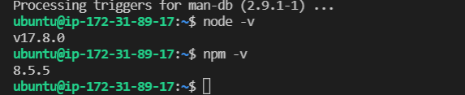

- Created a new directory for the project. Project is a To-do list so created a To-do directory by running `mkdir Todo`

Initialized project by running `npm init` to create the `package.json` file, which contains info about the ap and the dependencies it needs to run.
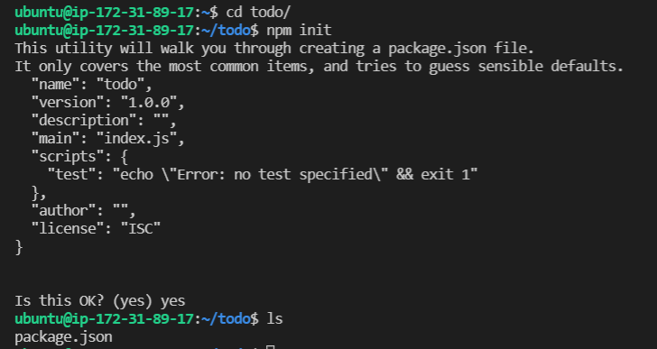

**Step 1.1 - Install ExpressJS**
---

- Ran `npm install express` to install ExpressJS.

- Ran `npm install dotenv` to install the dotenv module. Also created an index.js file by running `touch index.js`, inside the todo folder I created earlier.

- Ran `vim index.js` to edit the index.js file using the vim editor.
    - Pasted the below configuration into the index.js file and saved the changes.
```
    const express = require('express');
require('dotenv').config();

const app = express();

const port = process.env.PORT || 5000;

app.use((req, res, next) => {
res.header("Access-Control-Allow-Origin", "\*");
res.header("Access-Control-Allow-Headers", "Origin, X-Requested-With, Content-Type, Accept");
next();
});

app.use((req, res, next) => {
res.send('Welcome to Express');
});

app.listen(port, () => {
console.log(`Server running on port ${port}`)
});
```

- Started the server by using `node index.js` in the terminal to see if the server is running. Server is running on port 5000 as seen below:
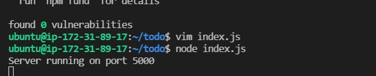

- Opened up port 5000 on the NSG to allow for communication since the server is running on port 5000.
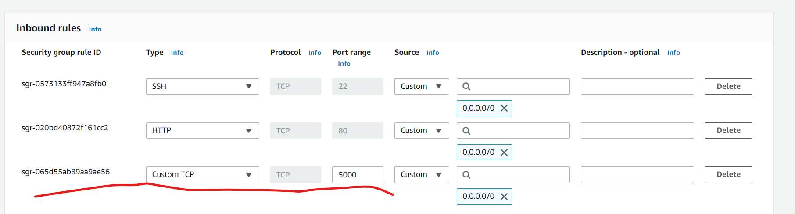

    - Checked if I could access the server on my browser via the public ip address. Test was successful.
    

- Creating routes for the application, which is necessary as that would define endpoints the To-do app will depend on. Without the routes, the app would not know where to look to perform POST, GET & DELETE operations.

    - Created a routes directory in the todo folder to store a route config. Went into the routes folder (/todo/routes/) and created an api.js file and edited using vim to setup the route config.

```
const express = require ('express');
const router = express.Router();

router.get('/todos', (req, res, next) => {

});

router.post('/todos', (req, res, next) => {

});

router.delete('/todos/:id', (req, res, next) => {

})

module.exports = router;
```

**Step 1.2 - Creating Models**
---

- Creating a model that would be used to define the database schema. This is important so that the fields stored in each Mongodb document will be well defined.

    - Changed back to the todo folder and installed Mongoose, which is a Node.js package that makes working with MongoDB easier. This was done using `npm install mongoose`.

    - Created a new folder called `models`, changed to that folder and created a new file called `todo.js`. This was done using `mkdir models && cd models && touch todo.js`.

    - Used VIM to edit the todo.js file to paste in config settings below.
    
```
const mongoose = require('mongoose');
const Schema = mongoose.Schema;

//create schema for todo
const TodoSchema = new Schema({
action: {
type: String,
required: [true, 'The todo text field is required']
}
})

//create model for todo
const Todo = mongoose.model('todo', TodoSchema);

module.exports = Todo;
```

- Next would be to update the routes in the api.js file created earlier in the routes folder to make use of the new model.

    - Used VIM to edit the api.js file to paste in the below config settings. Since the file had previous configs already, I used `:%d` to delete them.

```
const express = require ('express');
const router = express.Router();
const Todo = require('../models/todo');

router.get('/todos', (req, res, next) => {

//this will return all the data, exposing only the id and action field to the client
Todo.find({}, 'action')
.then(data => res.json(data))
.catch(next)
});

router.post('/todos', (req, res, next) => {
if(req.body.action){
Todo.create(req.body)
.then(data => res.json(data))
.catch(next)
}else {
res.json({
error: "The input field is empty"
})
}
});

router.delete('/todos/:id', (req, res, next) => {
Todo.findOneAndDelete({"_id": req.params.id})
.then(data => res.json(data))
.catch(next)
})

module.exports = router;
```
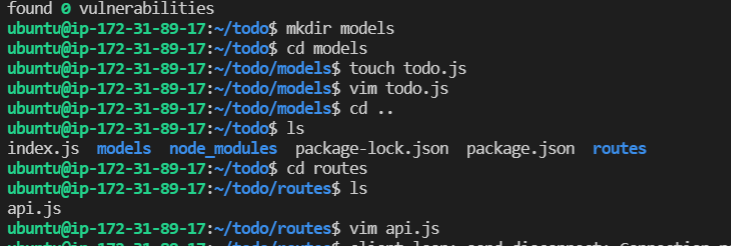

**Step 1.3 - Installing MongoDB database**
---

- Set up my MongoDB database and collection in mLab.
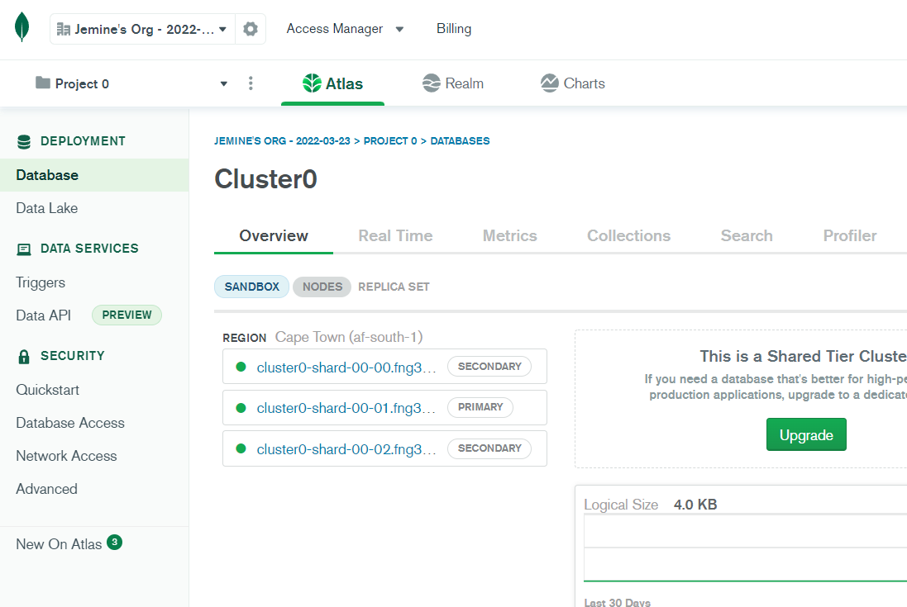

- Configured the access and entry deletion as seen below.
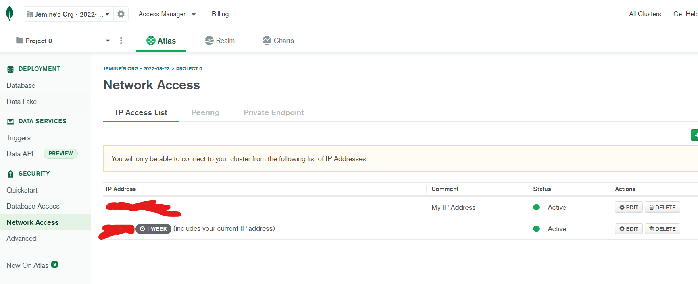

- Created the `.env` file that would be used to access environment variables, as was specified in the index.js file. Process.env was specified in index.js but was not yet created and thus, had no way to access environment variables.
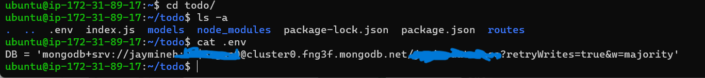

    - Also added the database connection string and updated the values as seen above.

- Modified the `index.js` file to make use of the newly created `.env` file to allow Node.js connect to the database. The previous config was deleted and replaced with the one below.

```
const express = require('express');
const bodyParser = require('body-parser');
const mongoose = require('mongoose');
const routes = require('./routes/api');
const path = require('path');
require('dotenv').config();

const app = express();

const port = process.env.PORT || 5000;

//connect to the database
mongoose.connect(process.env.DB, { useNewUrlParser: true, useUnifiedTopology: true })
.then(() => console.log(`Database connected successfully`))
.catch(err => console.log(err));

//since mongoose promise is depreciated, we overide it with node's promise
mongoose.Promise = global.Promise;

app.use((req, res, next) => {
res.header("Access-Control-Allow-Origin", "\*");
res.header("Access-Control-Allow-Headers", "Origin, X-Requested-With, Content-Type, Accept");
next();
});

app.use(bodyParser.json());

app.use('/api', routes);

app.use((err, req, res, next) => {
console.log(err);
next();
});

app.listen(port, () => {
console.log(`Server running on port ${port}`)
});
```

- Confirmed to see if all configs were correct bu running the index.js node with `node index.js`.
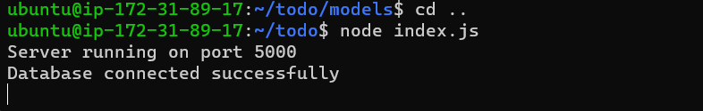

- Ran a check with Postman to test the API endpoints of the app to ensure they are working.

    - Created a POST request to the API via `http://<PublicIPaddress>:5000/api/todo` & ensured to set up the header key `Content-Type` as `application/json`
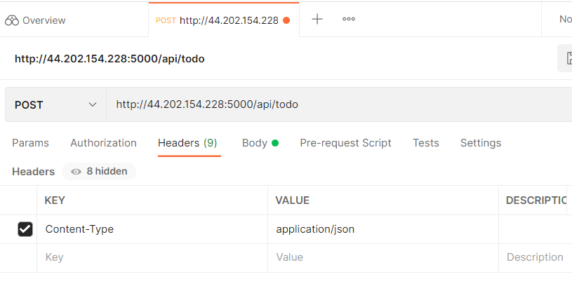

    - Created a GET request to retrieve the list of entries submitted via the POST request to the API and got the successful output below.
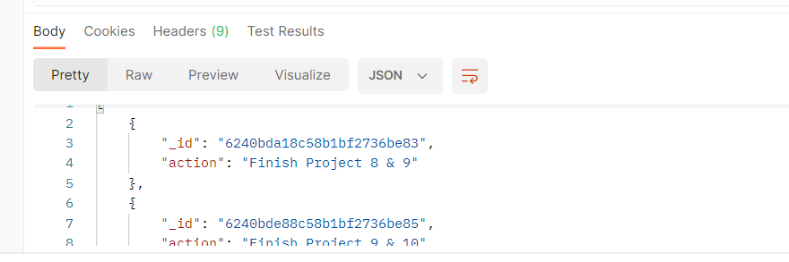

    - Created a DELETE request to remove some of the entries submitted by the POST request by adding the ID to the ID as part of the URL and NOT the body. See below.
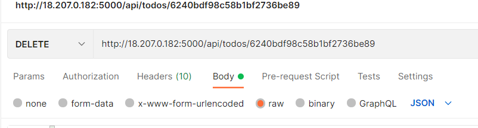

**Step 2 - Front End**
---

- In order to start with the app frontend, I used the `npx create-react-app client` command to scaffold the app.

- Installed the necessary dependencies before testing the app. The dependencies were done by running `npm install concurrently --save-dev` & `npm install nodemon --save-dev`.

- Modified the `package.json` file in the `Todo` folder to "see" the `index.js` file using the code below:
```
"scripts": {
"start": "node index.js",
"start-watch": "nodemon index.js",
"dev": "concurrently \"npm run start-watch\" \"cd client && npm start\""
},
```
After modification, it looked like this:
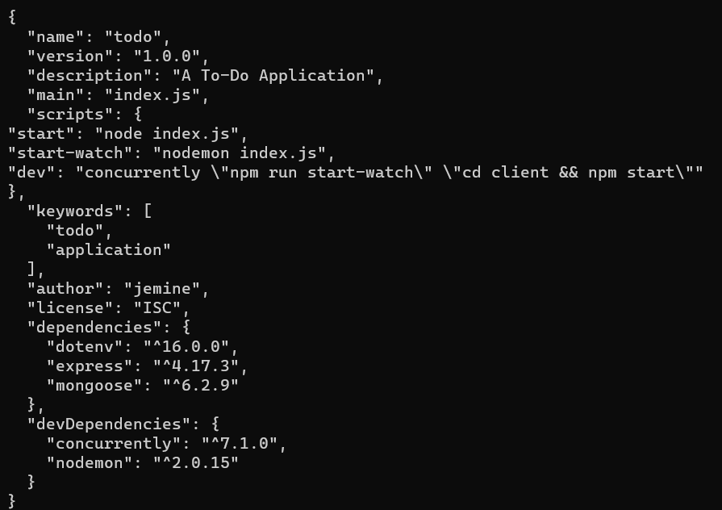

- Changed directory to `client` to add proxy configuration in the `package.json` file to make accessing the app over the internet possible. See the result below:
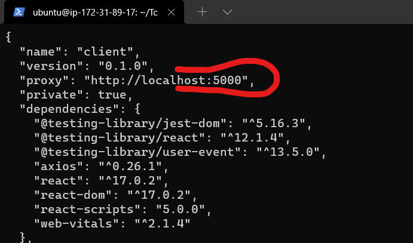

- Changed directory to `Todo` and and ran the command `npm run dev` to start the app.

- Moved to the `src` dir inside `client` and created a dir called `components`. Inside that, created `Input.js`, `ListTodo.js` & `Todo.js`.

    - Pasted the below code inside the `Input.js` file:
```
import React, { Component } from 'react';
import axios from 'axios';

class Input extends Component {

state = {
action: ""
}

addTodo = () => {
const task = {action: this.state.action}

    if(task.action && task.action.length > 0){
      axios.post('/api/todos', task)
        .then(res => {
          if(res.data){
            this.props.getTodos();
            this.setState({action: ""})
          }
        })
        .catch(err => console.log(err))
    }else {
      console.log('input field required')
    }

}

handleChange = (e) => {
this.setState({
action: e.target.value
})
}

render() {
let { action } = this.state;
return (
<div>
<input type="text" onChange={this.handleChange} value={action} />
<button onClick={this.addTodo}>add todo</button>
</div>
)
}
}

export default Input
```

- Changed directory to the `client` dir (inside src) to install Axios, which is a HTTP client for the browser and node.js. This was installed by running `npm install axios`

- Ran `cd src/components` & `vi ListTodo.js` & pasted the code below:
```
import React from 'react';

const ListTodo = ({ todos, deleteTodo }) => {

return (
<ul>
{
todos &&
todos.length > 0 ?
(
todos.map(todo => {
return (
<li key={todo._id} onClick={() => deleteTodo(todo._id)}>{todo.action}</li>
)
})
)
:
(
<li>No todo(s) left</li>
)
}
</ul>
)
}

export default ListTodo
```

- Modified the `Todo.js` file and added the config below in the file:
```
import React, {Component} from 'react';
import axios from 'axios';

import Input from './Input';
import ListTodo from './ListTodo';

class Todo extends Component {

state = {
todos: []
}

componentDidMount(){
this.getTodos();
}

getTodos = () => {
axios.get('/api/todos')
.then(res => {
if(res.data){
this.setState({
todos: res.data
})
}
})
.catch(err => console.log(err))
}

deleteTodo = (id) => {

    axios.delete(`/api/todos/${id}`)
      .then(res => {
        if(res.data){
          this.getTodos()
        }
      })
      .catch(err => console.log(err))

}

render() {
let { todos } = this.state;

    return(
      <div>
        <h1>My Todo(s)</h1>
        <Input getTodos={this.getTodos}/>
        <ListTodo todos={todos} deleteTodo={this.deleteTodo}/>
      </div>
    )

}
}

export default Todo;
```

- Went into the `src` dir and pasted the code below into the `App.js` file using vim:
```
import React from 'react';

import Todo from './components/Todo';
import './App.css';

const App = () => {
return (
<div className="App">
<Todo />
</div>
);
}

export default App;
```

- Modified `App.css` with the below config:
```
.App {
text-align: center;
font-size: calc(10px + 2vmin);
width: 60%;
margin-left: auto;
margin-right: auto;
}

input {
height: 40px;
width: 50%;
border: none;
border-bottom: 2px #101113 solid;
background: none;
font-size: 1.5rem;
color: #787a80;
}

input:focus {
outline: none;
}

button {
width: 25%;
height: 45px;
border: none;
margin-left: 10px;
font-size: 25px;
background: #101113;
border-radius: 5px;
color: #787a80;
cursor: pointer;
}

button:focus {
outline: none;
}

ul {
list-style: none;
text-align: left;
padding: 15px;
background: #171a1f;
border-radius: 5px;
}

li {
padding: 15px;
font-size: 1.5rem;
margin-bottom: 15px;
background: #282c34;
border-radius: 5px;
overflow-wrap: break-word;
cursor: pointer;
}

@media only screen and (min-width: 300px) {
.App {
width: 80%;
}

input {
width: 100%
}

button {
width: 100%;
margin-top: 15px;
margin-left: 0;
}
}

@media only screen and (min-width: 640px) {
.App {
width: 60%;
}

input {
width: 50%;
}

button {
width: 30%;
margin-left: 10px;
margin-top: 0;
}
}
```

- Added the below config file to the `index.css` file:
```
body {
margin: 0;
padding: 0;
font-family: -apple-system, BlinkMacSystemFont, "Segoe UI", "Roboto", "Oxygen",
"Ubuntu", "Cantarell", "Fira Sans", "Droid Sans", "Helvetica Neue",
sans-serif;
-webkit-font-smoothing: antialiased;
-moz-osx-font-smoothing: grayscale;
box-sizing: border-box;
background-color: #282c34;
color: #787a80;
}

code {
font-family: source-code-pro, Menlo, Monaco, Consolas, "Courier New",
monospace;
}
```

- Went back into the `Todo` directory and ran the app by using `npm run dev`.

- Tested the app on my web browser by going to <localhost>:3000. Successfully connected to the app and saw a list of all my previous entries.
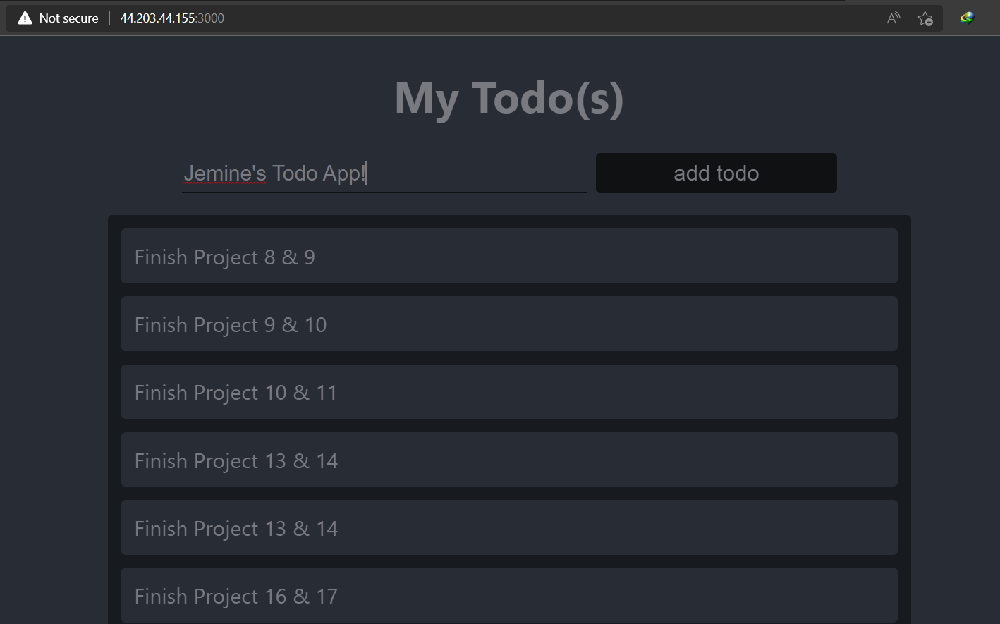

**MERN Stack Successfully Deployed**

***
**Note**
- I ran into the error below when running `node index.js` to start the node.
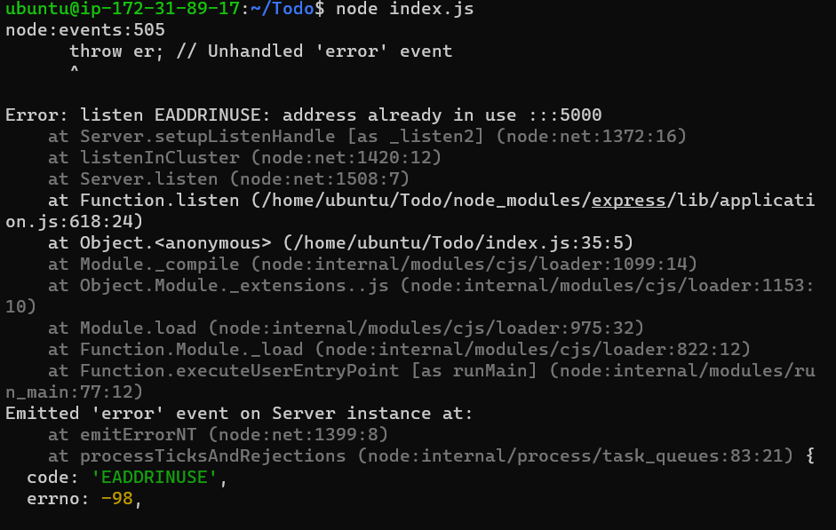
Turns out that the node wasn't properly shut down previously and threw that error saying that there was something running on that port already. I resolved the issue by getting the process ID and killing it. Using `lsof -i tcp:5000` & `kill <pid>`.

- I found this project particularly confusing due to the fact that there were many files/dirs with confusing naming conventions. E.g a folder named `Todo`, a file named `todo.js`, another one called `Todo.js` and in some of the code, some config pointing to `todos`. I actually thought they were "wrong" and intentionally done that way for us to figure it out so I tried making everything (including the code) conform to just `todo.js` for files, `todo` for directory and `todo` in all the code. It worked for a while but towards the end of the project I ran into some errors which I couldn't pinpoint. I had to use the tutorial videos as a last resort because I was spending too much time on the project, which helped me finish it up. Though the many "todos" are still weird.
